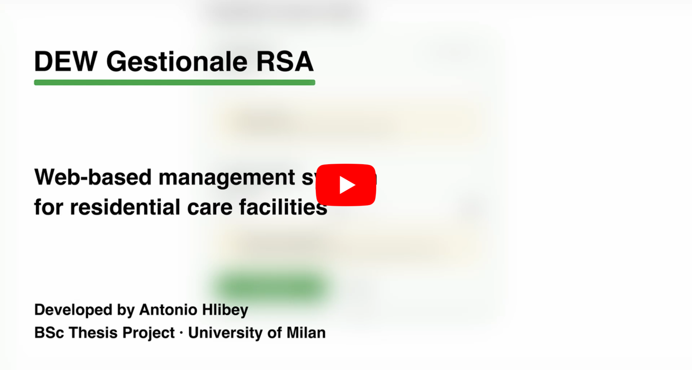

# DEW Gestionale RSA

A full-stack web application developed during my bachelor's internship and thesis project for a residential care facility (RSA).

The application provides an internal backoffice for managing **menus, dishes, users, dish suspensions, and food-related reports**, while sharing an existing database with a separate mobile application.


## Project Demo

[](https://youtu.be/PoXBFrT9blQ)

A short demo showcasing menu management, dish suspension and replacement, and food consumption statistics.

## What I built

The project covers several areas of the application's day-to-day management:

- Menu creation and management
- Dish management, including nutritional information, allergens and images
- Temporary dish suspensions and replacements
- Backoffice and mobile-app user management
- Dashboard, reports and food-consumption statistics
- Authentication and role-based access control

## Technical highlights

One of the main challenges was working with an **existing relational database shared with another application**. The web application therefore had to integrate with the existing data model without breaking the mobile app.

Some of the technical decisions I implemented include:

- **Layered backend architecture** with routes, controllers, services and repositories
- **JWT-based authentication** with HTTP-only cookies
- **Database-backed authorization**, so protected requests validate the current user rather than relying only on information stored in the token
- **Image upload handling** with file type and size restrictions
- **Scheduled backend tasks** protected by MySQL named locks to prevent concurrent execution
- A dedicated tracking structure for **dish replacement and restoration workflows**, without modifying shared core tables

The project also involved refactoring parts of the original codebase into smaller and more maintainable modules.

## Tech stack

**Frontend**

- React
- Vite
- React Router
- Tailwind CSS

**Backend**

- Node.js
- Express
- MySQL
- JWT
- Multer
- Cron jobs

**Deployment**

- Linux
- Nginx
- PM2

## Architecture

The application is organized into separate layers and reusable modules.

```text
backend/
├── routes/
├── controllers/
├── services/
├── repositories/
├── middlewares/
├── db/
├── config/
└── utils/

frontend/
├── pages/
├── components/
├── hooks/
├── services/
├── context/
└── utils/
```

## Running locally

### Frontend

```bash
npm install
npm run dev
```

### Backend

```bash
cd backend
npm install
npm run dev
```

Environment variables are documented in the provided `.env.example` files.

## Project context

This project was developed as part of my **BSc in Computer Science for Digital Communication at the University of Milan**, during an internship and thesis project.

It was my first experience working on a full-stack application connected to an existing production-oriented system, and it gave me practical experience with software architecture, databases, authentication, deployment and maintaining an evolving codebase.
